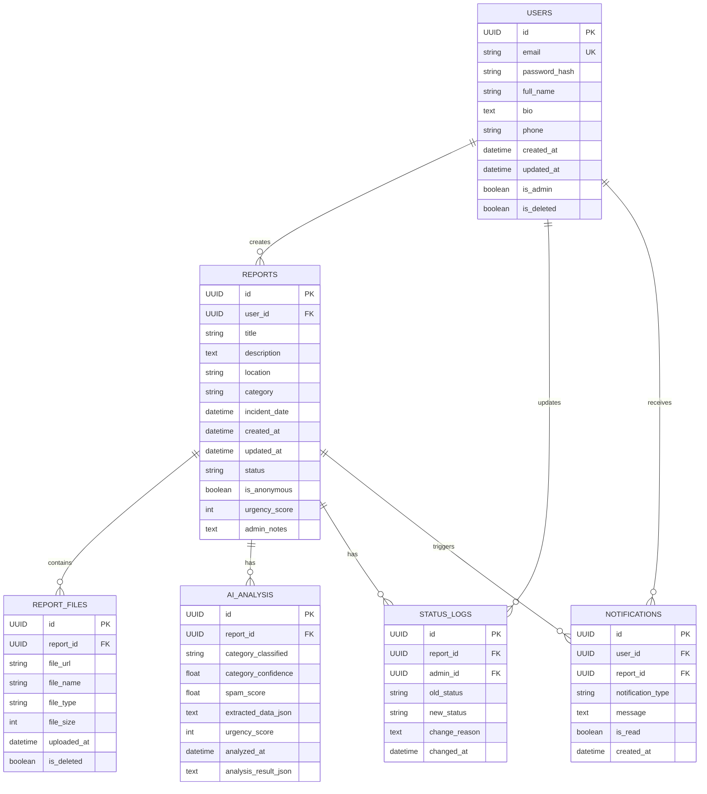

# PRD — Lapor In
## Platform Pelaporan Pungutan Liar Berbasis Web dengan AI Integration

---

## I. INFORMASI UMUM

| Aspek | Detail |
|-------|--------|
| **Nama Produk / Proyek** | Lapor In |
| **Tagline** | Melawan Pungli, Jelas dan Aman |
| **Tema SDGs** | SDG 16 – Peace, Justice, and Strong Institutions |
| **Kategori Produk** | Web App & AI Platform |
| **Target Platform** | Web (Desktop & Mobile Responsive) |
| **Timeline Pengerjaan** | 2-4 minggu (Final Project MVP) |
| **Status** | Development Phase |

---

## II. KONSEP PRODUK (PRODUCT CONCEPT)

### 1. Latar Belakang & Masalah Nyata (The Pain Point)

#### Permasalahan yang Dihadapi

Pungutan liar (pungli) masih menjadi permasalahan yang sering terjadi dalam berbagai sektor pelayanan publik, termasuk:

- **Administrasi Publik** – Biaya tambahan untuk pengurusan dokumen, perizinan, atau surat-menyurat
- **Sektor Pendidikan** – Pungutan liar untuk masuk, pindah sekolah, atau pengurusan administrasi kampus
- **Kesehatan** – Biaya tambahan untuk layanan kesehatan publik atau administrasi rumah sakit
- **Layanan Umum Lainnya** – SAMSAT, polisi, administrasi kantor gubernur/bupati/wali kota

#### Dampak Permasalahan

1. **Kerugian Finansial** – Masyarakat mengeluarkan biaya tambahan yang tidak resmi
2. **Ketidakadilan** – Hanya mereka yang mampu bayar yang mendapat layanan yang lebih baik
3. **Erosi Kepercayaan** – Masyarakat semakin tidak percaya pada institusi publik
4. **Partisipasi Rendah** – Banyak kasus tidak dilaporkan karena:
   - Khawatir identitas diketahui dan mendapat perlakuan tidak adil
   - Tidak memahami jalur pelaporan yang tersedia
   - Proses pelaporan konvensional dianggap rumit dan lambat
   - Takut akan dampak negatif dari pelaporan

#### Target Pengguna yang Terkena Dampak

- **Mahasiswa** – Sering mengurus administrasi kampus dan berisiko kena pungli
- **Masyarakat Umum** – Mengurus layanan publik (KTP, SIM, perizinan)
- **Gen Z** – Generasi digital yang lebih nyaman dengan platform online
- **Pelaku UMKM** – Sering berurusan dengan birokrasi dan perizinan

### 2. Solusi & Value Proposition (The Solution & User)

#### Solusi Kami

**Lapor In** adalah platform pelaporan pungutan liar berbasis web yang memberdayakan masyarakat untuk melaporkan kasus secara **mudah**, **aman**, dan **transparan**. Platform ini menghubungkan pelapor dengan sistem pengelolaan laporan yang terstruktur, didukung oleh teknologi AI untuk analisis otomatis, serta dashboard admin yang memudahkan proses validasi dan follow-up.

#### Cara Kerja Solusi

1. **Pelaporan Online** – Pengguna dapat membuat laporan pungli melalui form yang sederhana
2. **Perlindungan Identitas** – Mode anonim memungkinkan pengguna menyembunyikan identitas
3. **Upload Bukti** – Pengguna dapat mengunggah foto/dokumen sebagai pendukung laporan
4. **Analisis AI** – Sistem AI otomatis mengklasifikasikan, mendeteksi duplikasi, dan prioritas laporan
5. **Real-time Tracking** – Pengguna dapat memantau perkembangan laporan setiap saat
6. **Dashboard Admin** – Admin dapat mengelola laporan dengan efisien dan transparan

#### Target Pengguna

| Segmen | Karakteristik | Kebutuhan |
|--------|---------------|----------|
| **Mahasiswa** | Digital native, cepat adaptif | Mudah digunakan, mobile-friendly |
| **Masyarakat Umum** | Berbagai usia, literasi digital beragam | Interface intuitif, dukungan jelas |
| **Gen Z** | Aktif di social media, mencari transparansi | Real-time updates, anonim option |
| **Pelaku UMKM** | Sibuk, sering berinteraksi birokrasi | Efisien, mudah diakses kapan saja |

#### Value Proposition

> **"Lapor In memberikan solusi pelaporan pungutan liar yang mudah diakses, aman, dan transparan bagi semua kalangan masyarakat."**

**Manfaat Utama untuk Pengguna:**
- ✅ **Kemudahan Akses** – Cukup isi form online tanpa proses rumit
- ✅ **Keamanan Identitas** – Mode anonim melindungi identitas pelapor
- ✅ **Transparansi Proses** – Real-time tracking perkembangan laporan
- ✅ **Bukti Terstruktur** – Upload file pendukung dengan mudah
- ✅ **Analisis Otomatis** – AI membantu mengklasifikasikan dan prioritas laporan
- ✅ **Rasa Aman** – Tidak perlu takut akan balasan atau diskriminasi

**Manfaat untuk Admin/Institusi:**
- 📊 Pengelolaan laporan terstruktur dan efisien
- 📈 Dashboard statistik untuk monitoring kasus
- 🤖 AI membantu memprioritaskan kasus yang urgent
- 📋 Filter dan pencarian laporan yang cepat
- 📝 Dokumentasi lengkap setiap laporan

### 3. Skalabilitas Dampak (Scalability & Impact)

#### Fase Pertumbuhan Pengguna

**MVP Phase (0-1 bulan):**
- Target: 100-500 pengguna aktif
- Scope: Fitur core MVP saja
- Infrastructure: Single server, database basic

**Growth Phase (1-3 bulan):**
- Target: 500-5000 pengguna aktif
- Scope: Tambah dashboard statistik, notifikasi email
- Infrastructure: Multi-server, CDN untuk file storage

**Scale Phase (3-12 bulan):**
- Target: 5000-50000+ pengguna
- Scope: Mobile app, API publik, integrasi instansi
- Infrastructure: Kubernetes, advanced caching, multi-region

#### Rencana Pengembangan Jangka Panjang

1. **Mobile Application** – Native iOS & Android apps
2. **API Integration** – Integrasi dengan sistem pelaporan resmi nasional (SPPP, LAPOR!)
3. **Advanced Analytics** – Dashboard dengan predictive analytics
4. **AI Enhancement** – Machine learning model khusus untuk akurasi lebih tinggi
5. **Notifikasi Real-time** – Push notification, SMS, WhatsApp integration
6. **Multi-language Support** – Dukungan untuk berbagai bahasa daerah
7. **Blockchain Integration** – Laporan immutable untuk kepercayaan maksimal

#### Impact Metrics

| Metrik | Target MVP | Target 1 Tahun |
|--------|-----------|-----------------|
| Active Users | 500+ | 50,000+ |
| Monthly Reports | 100+ | 10,000+ |
| Report Resolution Rate | 70% | 90% |
| User Satisfaction (NPS) | 60+ | 75+ |

---

## III. IMPLEMENTASI ARTIFICIAL INTELLIGENCE (AI)

### 1. Provider dan Model AI

| Aspek | Detail |
|-------|--------|
| **AI Provider** | OpenRouter |
| **Model Utama** | Claude 3 (via OpenRouter) - Free tier available |
| **Model Backup** | Llama 2 (Free via OpenRouter) |
| **Cost Strategy** | Menggunakan free tier untuk MVP, upgrade ke paid plan saat scale |

### 2. Peran AI dalam Produk

#### Use Case 1: Klasifikasi Kategori Laporan

**Tujuan:** Secara otomatis mengklasifikasikan laporan ke kategori pungli yang sesuai

**Alur:**
1. Pengguna mengirim laporan dengan deskripsi
2. AI menganalisis deskripsi dan mengidentifikasi kategori pungli
3. Sistem merekomendasikan kategori kepada pengguna

**Kategori yang Diklasifikasi:**
- Pungli Administrasi
- Pungli Pendidikan
- Pungli Kesehatan
- Pungli Kepolisian
- Pungli Perizinan/Bisnis
- Pungli Lainnya

**Contoh Implementasi:**
```
User Input: "Saya diminta bayar 100rb untuk proses KTP di kantor camat, padahal seharusnya gratis"

AI Response:
{
  "category": "Pungli Administrasi",
  "confidence": 0.95,
  "key_phrases": ["bayar", "KTP", "kantor camat", "gratis"],
  "suggested_action": "Prioritas Tinggi - Melibatkan layanan publik"
}
```

#### Use Case 2: Deteksi Spam dan Duplikasi

**Tujuan:** Mencegah laporan spam atau duplikat yang mengganggu sistem

**Fitur:**
1. Deteksi laporan spam (pola umum)
2. Deteksi laporan duplikat (deskripsi/lokasi serupa)
3. Deteksi laporan palsu (tanda-tanda tidak kredibel)

**Output:**
- **High Spam Risk** – Reject otomatis atau flag untuk review manual
- **Moderate Risk** – Tetap diterima tapi diberi warning
- **Low Risk** – Lanjut ke proses normal

#### Use Case 3: Ekstraksi Informasi Penting

**Tujuan:** Mengekstrak data struktur dari deskripsi laporan yang tidak terstruktur

**Data yang Diektrak:**
- Institusi/lokasi yang disebutkan
- Nama/identitas (jika disebutkan)
- Jumlah uang yang diminta
- Tanggal dan waktu insiden
- Orang-orang yang terlibat

**Manfaat:** Memudahkan admin untuk quick review dan pencarian laporan

#### Use Case 4: Prioritas Laporan

**Tujuan:** Memberikan scoring prioritas untuk membantu admin fokus pada kasus urgent

**Kriteria Prioritas:**
- Jumlah uang yang besar → Prioritas tinggi
- Instansi kritis (polisi, pengadilan) → Prioritas tinggi
- Laporan yang sering terjadi → Prioritas sedang
- Laporan pertama kali → Prioritas sedang

**Scoring: 1-10 (10 = paling urgent)**

### 3. AI Workflow & Architecture

```
┌─────────────────┐
│  User Input     │
│  (Laporan)      │
└────────┬────────┘
         │
         ▼
┌─────────────────────────┐
│  Data Preprocessing     │
│ • Clean text            │
│ • Extract metadata      │
└────────┬────────────────┘
         │
         ▼
┌─────────────────────────────────┐
│  AI Analysis (Claude/Llama)     │
│ • Klasifikasi kategori          │
│ • Deteksi spam/duplikat         │
│ • Ekstraksi informasi           │
│ • Scoring prioritas             │
└────────┬────────────────────────┘
         │
         ▼
┌─────────────────────────┐
│  Result Formatting      │
│ • Structure response    │
│ • Add confidence score  │
└────────┬────────────────┘
         │
         ▼
┌─────────────────────────┐
│  Storage & Logging      │
│ • Save to database      │
│ • Log untuk audit trail │
└─────────────────────────┘
```

### 4. AI Prompt Template

```
You are a legal analyst assistant specializing in Indonesian law and public service regulations.

Your task: Analyze the following incident report and provide:
1. Category classification (from: Administrasi, Pendidikan, Kesehatan, Kepolisian, Perizinan, Lainnya)
2. Spam/Duplicate detection score (0-1, where 1 = likely spam)
3. Key information extraction (institution, amount, date, people involved)
4. Urgency score (1-10, where 10 = most urgent)
5. Brief summary for admin review

Report Content:
[USER_REPORT_CONTENT]

Respond ONLY in valid JSON format:
{
  "category": "string",
  "category_confidence": 0.0,
  "spam_score": 0.0,
  "extracted_data": {...},
  "urgency_score": 1,
  "summary": "string"
}
```

### 5. Integration Points

**Endpoint AI:**
```
POST /api/ai/analyze-report
Content-Type: application/json

{
  "report_id": "uuid",
  "title": "string",
  "description": "string",
  "location": "string"
}

Response:
{
  "success": true,
  "analysis": {
    "category": "string",
    "category_confidence": 0.95,
    "spam_score": 0.05,
    "urgency_score": 7,
    "summary": "string"
  }
}
```

---

## IV. DAFTAR FITUR & RUANG LINGKUP (MVP METHOD)

### Fitur Breakdown

| No | Nama Fitur | Deskripsi | Kategori | Kompleksitas | Estimasi Waktu |
|----|-----------|-----------|----------|-------------|-----------------|
| 1 | **Registrasi & Login** | Pengguna membuat akun dengan email/password, login, dan manage profile | Core MVP | Low | 2 hari |
| 2 | **Buat Laporan Pungli** | Form lengkap untuk membuat laporan: judul, deskripsi, lokasi, kategori, tanggal | Core MVP | Medium | 3 hari |
| 3 | **Upload Bukti** | Upload foto/dokumen pendukung laporan dengan validasi file | Core MVP | Medium | 2 hari |
| 4 | **Mode Anonim** | Toggle untuk menyembunyikan identitas pelapor | Core MVP | Low | 1 hari |
| 5 | **AI Analisis Laporan** | Klasifikasi kategori, deteksi spam/duplikasi, prioritas otomatis | Core MVP | High | 3 hari |
| 6 | **Tracking Status Laporan** | Real-time status tracking: Diterima → Ditinjau → Diproses → Selesai/Ditolak | Core MVP | Medium | 2 hari |
| 7 | **Riwayat Laporan** | Daftar semua laporan pengguna dengan status dan tanggal | Core MVP | Low | 1 hari |
| 8 | **Detail Laporan** | Halaman detail lengkap: laporan, bukti, analisis AI, timeline, catatan admin | Core MVP | Medium | 2 hari |
| 9 | **Dashboard Admin** | Kelola laporan masuk, filter, change status, monitor analisis AI | Core MVP | High | 4 hari |
| 10 | **Pencarian & Filter** | Search dan filter laporan berdasarkan kategori, status, kata kunci | Core MVP | Medium | 2 hari |
| 11 | **Dashboard Statistik** | Visualisasi jumlah laporan, kategori, status penyelesaian | Nice-to-Have | Medium | 2 hari |
| 12 | **Notifikasi Update** | In-app & email notification saat status laporan berubah | Nice-to-Have | Medium | 2 hari |
| 13 | **Export Laporan** | Export laporan ke PDF/CSV untuk admin reporting | Nice-to-Have | Low | 1 hari |

### Prioritas Pengembangan MVP

#### Fase 1: Core MVP (Wajib)
**Estimasi: 10-14 hari**

- ✅ Registrasi & Login
- ✅ Buat Laporan Pungli
- ✅ Upload Bukti
- ✅ Mode Anonim
- ✅ Tracking Status Laporan
- ✅ Dashboard Admin
- ✅ Pencarian & Filter
- ✅ Detail Laporan
- ✅ Riwayat Laporan

#### Fase 2: AI Integration (Prioritas Tinggi)
**Estimasi: 3-5 hari**

- ✅ AI Analisis Laporan
- ✅ Integrasi OpenRouter API
- ✅ Testing AI accuracy

#### Fase 3: Enhancement (Optional)
**Estimasi: 3-4 hari (jika waktu tersedia)**

- 🔄 Dashboard Statistik
- 🔄 Notifikasi Email
- 🔄 Export Laporan

### Catatan Scope MVP

- **Fokus Utama:** Proses pelaporan end-to-end harus berjalan sempurna
- **AI Scope:** Klasifikasi berbasis prompt, bukan ML training custom
- **Database:** Struktur simple namun ekstensibel untuk fitur future
- **UI/UX:** Minimal design, fokus usability daripada aesthetic
- **Testing:** Unit test untuk core logic, manual testing untuk flow

---

## V. USER FLOW & JOURNEY

### 1. User Journey Map

```
┌─────────────────────────────────────────────────────────────────┐
│                      LAPOR IN - USER JOURNEY                    │
├─────────────────────────────────────────────────────────────────┤

PHASE 1: ONBOARDING
├─ [1] User membuka lapor.in via browser
├─ [2] Pilih "Buat Akun Baru"
├─ [3] Isi form registrasi (email, password, nama)
├─ [4] Verifikasi email (jika diperlukan)
└─ [5] Login ke dashboard utama

PHASE 2: MEMBUAT LAPORAN
├─ [6] Klik "Buat Laporan Baru"
├─ [7] Isi form laporan:
│     ├─ Judul laporan
│     ├─ Deskripsi detail kejadian
│     ├─ Lokasi kejadian
│     ├─ Kategori pungli
│     ├─ Tanggal/waktu kejadian
│     └─ Pilihan mode anonim
├─ [8] Upload bukti (foto/dokumen)
├─ [9] Review laporan
├─ [10] Klik "Kirim Laporan"
└─ [11] Sistem AI otomatis menganalisis laporan

PHASE 3: PROCESSING
├─ [12] Admin menerima notifikasi laporan baru
├─ [13] Admin review laporan + analisis AI
├─ [14] Admin mengubah status laporan (Ditinjau → Diproses)
└─ [15] Sistem mengirim notifikasi ke pengguna

PHASE 4: FOLLOW-UP
├─ [16] Pengguna membuka "Riwayat Laporan"
├─ [17] Klik laporan untuk melihat detail
├─ [18] Lihat status terkini dan timeline proses
└─ [19] Terima notifikasi saat status berubah

PHASE 5: COMPLETION
├─ [20] Admin menyelesaikan proses laporan
├─ [21] Status berubah ke "Selesai" atau "Ditolak"
├─ [22] Sistem mengirim notifikasi finalisasi
└─ [23] Pengguna dapat logout
```

### 2. Detailed User Flow per Feature

#### A. Registrasi & Login
```
User → Homepage
  ↓
[Belum punya akun?] → Registrasi Form
  ↓
Isi Email, Password, Nama
  ↓
Klik "Daftar"
  ↓
Verifikasi Email (optional)
  ↓
Email Verified → Dashboard
  ↓
[Login] → Input Email & Password
  ↓
Authenticated → Dashboard Utama
```

#### B. Membuat Laporan
```
Dashboard → [Buat Laporan Baru]
  ↓
Form Laporan:
├─ Judul Laporan (required)
├─ Deskripsi (required) [AI suggestion: kategori]
├─ Lokasi (required)
├─ Kategori (required) [AI recommended]
├─ Tanggal Kejadian (required)
└─ Mode Anonim? (checkbox)
  ↓
Upload Bukti (optional)
  ├─ Validasi file (max 5MB, jpg/png/pdf)
  └─ Preview file
  ↓
[Klik "Kirim Laporan"]
  ↓
Laporan Disimpan
  ↓
AI Processing:
  ├─ Klasifikasi
  ├─ Spam detection
  ├─ Ekstraksi data
  └─ Prioritas scoring
  ↓
Status: "Diterima" [✓]
  ↓
User dapat lihat detail laporan
  ↓
Notifikasi: "Laporan Anda berhasil dibuat"
```

#### C. Tracking Status Laporan
```
Dashboard → [Riwayat Laporan]
  ↓
Daftar laporan pengguna:
├─ Laporan 1 [Status: Diterima] [Created: 2024-05-20]
├─ Laporan 2 [Status: Diproses] [Created: 2024-05-19]
└─ Laporan 3 [Status: Selesai] [Created: 2024-05-15]
  ↓
[Klik Laporan] → Detail Page
  ↓
Timeline Status:
├─ [✓] Diterima (2024-05-20 10:30)
├─ [✓] Ditinjau (2024-05-21 14:00)
├─ [→] Diproses (2024-05-22)
└─ [ ] Selesai (-)
  ↓
Informasi Laporan:
├─ Judul, Deskripsi, Lokasi
├─ Bukti upload
├─ AI Analysis Result
└─ Catatan Admin (jika ada)
```

#### D. Dashboard Admin
```
Login as Admin → Admin Dashboard
  ↓
Overview:
├─ Total Laporan: 245
├─ Pending: 12
├─ Processing: 8
└─ Completed: 225
  ↓
Laporan List:
├─ Filter: [Kategori] [Status] [Date Range]
├─ Search: [Keyword]
└─ Daftar laporan dengan AI analysis badge
  ↓
[Klik Laporan] → Admin Detail View
  ↓
Review:
├─ Laporan lengkap
├─ AI Analysis result dengan confidence score
├─ Bukti upload (preview)
└─ History/timeline
  ↓
Action:
├─ [Change Status] → Dropdown (Ditinjau/Diproses/Selesai/Ditolak)
├─ [Add Note] → Internal note untuk team
├─ [Assign To] → Assign ke staff tertentu
└─ [Save Changes]
  ↓
Notifikasi otomatis ke pengguna tentang perubahan status
```

---

## VI. SYSTEM ARCHITECTURE

### 1. High-Level Architecture Diagram

```
┌────────────────────────────────────────────────────────────────┐
│                        CLIENT LAYER                            │
│  ┌──────────────────────────────────────────────────────────┐  │
│  │  Web Browser (Desktop & Mobile Responsive)              │  │
│  │  - Next.js Frontend (React)                             │  │
│  │  - Pages: Auth, Dashboard, Report, Admin                │  │
│  │  - Local Storage: Session, Cache                        │  │
│  └──────────────────────────────────────────────────────────┘  │
└────────────────────────────────────────────────────────────────┘
                              │
                              │ HTTPS/API Calls
                              ▼
┌────────────────────────────────────────────────────────────────┐
│                       API LAYER (Backend)                      │
│  ┌──────────────────────────────────────────────────────────┐  │
│  │  Next.js API Routes (Backend)                           │  │
│  │  - /api/auth/*       → Authentication                   │  │
│  │  - /api/reports/*    → CRUD Reports                     │  │
│  │  - /api/admin/*      → Admin operations                 │  │
│  │  - /api/ai/*         → AI Integration                   │  │
│  │  - /api/file/*       → File upload/storage              │  │
│  │  - Middleware: JWT Auth, Rate limiting, Error handling  │  │
│  └──────────────────────────────────────────────────────────┘  │
└────────────────────────────────────────────────────────────────┘
         │                  │                  │
         ▼                  ▼                  ▼
┌──────────────────┐  ┌──────────────────┐  ┌──────────────────┐
│   Database       │  │   AI Service     │  │  File Storage    │
│   (Supabase      │  │   (OpenRouter)   │  │  (Supabase       │
│    PostgreSQL)   │  │                  │  │   Storage)       │
│                  │  │  - Claude 3      │  │                  │
│  Tables:         │  │  - Llama 2       │  │  - Report images │
│  - users         │  │                  │  │  - Documents     │
│  - reports       │  │  Endpoints:      │  │  - Receipts      │
│  - report_files  │  │  - Analyze       │  │                  │
│  - ai_logs       │  │  - Classify      │  │  Max: 50MB/file  │
│  - status_logs   │  │                  │  │                  │
└──────────────────┘  └──────────────────┘  └──────────────────┘
```

### 2. API Routes Documentation

```
BASE URL: https://lapor-in.app/api

AUTHENTICATION
├─ POST   /auth/register          → Register new user
├─ POST   /auth/login             → Login & get JWT token
├─ POST   /auth/logout            → Logout
├─ POST   /auth/refresh           → Refresh JWT token
└─ GET    /auth/me                → Get current user profile

REPORTS (User)
├─ POST   /reports                → Create new report
├─ GET    /reports                → Get user's reports
├─ GET    /reports/:id            → Get report detail
├─ PATCH  /reports/:id            → Update report (pending only)
└─ DELETE /reports/:id            → Delete report (pending only)

REPORTS (Admin)
├─ GET    /admin/reports          → Get all reports (paginated, filtered)
├─ PATCH  /admin/reports/:id      → Update report status
├─ POST   /admin/reports/:id/note → Add admin note
├─ GET    /admin/stats            → Get dashboard statistics
└─ GET    /admin/reports/export   → Export reports (PDF/CSV)

FILE UPLOAD
├─ POST   /files/upload           → Upload report files
├─ GET    /files/:id              → Download file
└─ DELETE /files/:id              → Delete file (admin)

AI SERVICE
├─ POST   /ai/analyze             → Analyze & classify report
├─ POST   /ai/detect-spam         → Check spam/duplicate
└─ GET    /ai/logs/:id            → Get AI analysis log
```

### 3. Data Flow Diagram

```
USER CREATES REPORT
    │
    ▼
┌─────────────────────────────┐
│ Frontend: Report Form       │
│ - Collect user input        │
│ - Validation                │
└─────────────┬───────────────┘
              │
              ▼
┌─────────────────────────────┐
│ API: /api/reports [POST]    │
│ - Auth check                │
│ - Input validation          │
│ - Generate report ID        │
└─────────────┬───────────────┘
              │
              ├─ Save to DB ─────────────┐
              │                          │
              ├─ Upload files ────────────┼──→ Supabase Storage
              │                          │
              └─ Trigger AI Analysis     │
                    │                    │
                    ▼                    │
        ┌─────────────────────────┐     │
        │ AI Service              │     │
        │ - Classify category     │     │
        │ - Detect spam           │     │
        │ - Extract info          │     │
        │ - Calculate priority    │     │
        └─────────────┬───────────┘     │
                      │                 │
                      ▼                 ▼
        ┌──────────────────────────────────┐
        │ Database Update                  │
        │ - Save AI analysis result        │
        │ - Update status to "Diterima"    │
        │ - Create timeline entry          │
        └────────────────┬─────────────────┘
                         │
                         ▼
        ┌──────────────────────────────┐
        │ Notification System          │
        │ - Send to user (in-app)      │
        │ - Queue email (async)        │
        └──────────────────────────────┘
                         │
                         ▼
        ┌──────────────────────────────┐
        │ Response to Frontend         │
        │ - Report ID                  │
        │ - Status: "Diterima"         │
        │ - Redirect to detail page    │
        └──────────────────────────────┘
```

### 4. Deployment Architecture

```
┌──────────────────────────────────────────────────┐
│           VERCEL (Deployment Platform)           │
├──────────────────────────────────────────────────┤
│                                                  │
│  ┌────────────────────────────────────────────┐ │
│  │ Next.js Application                        │ │
│  │ - Frontend: React Components               │ │
│  │ - Backend: API Routes                      │ │
│  │ - Auto scaling, CDN, CI/CD                 │ │
│  └────────────────────────────────────────────┘ │
│                                                  │
└───────────────────┬──────────────────────────────┘
                    │
    ┌───────────────┼───────────────┐
    ▼               ▼               ▼
┌─────────┐    ┌──────────┐    ┌──────────┐
│Supabase │    │OpenRouter│    │Stripe    │
│Database │    │AI API    │    │Payment   │
│Storage  │    │          │    │(future)  │
└─────────┘    └──────────┘    └──────────┘
```

### 5. Security Architecture

```
┌──────────────────────────────────────────────────┐
│           SECURITY LAYERS                        │
├──────────────────────────────────────────────────┤

Layer 1: Network Security
├─ HTTPS/TLS encryption for all traffic
├─ CORS policy configured
└─ Rate limiting (prevent DoS)

Layer 2: Authentication
├─ JWT tokens (exp: 24 hours)
├─ Refresh token mechanism
├─ Secure password hashing (bcrypt)
└─ Email verification (optional)

Layer 3: Authorization
├─ Role-based access control (User, Admin)
├─ Resource ownership check
├─ API endpoint protection
└─ Admin-only operations

Layer 4: Data Protection
├─ Anonymous mode (null user data in reports)
├─ File upload validation (size, type)
├─ SQL injection prevention (prepared statements)
├─ XSS protection (input sanitization)
└─ CSRF tokens (if needed)

Layer 5: AI Service Security
├─ API key management (env variables)
├─ Request signing
├─ Response validation
└─ Usage monitoring
```

---

## VII. DATABASE SCHEMA

### 1. Entity Relationship Diagram



### 2. Table Structure Detailed

#### USERS
```sql
CREATE TABLE users (
    id UUID PRIMARY KEY DEFAULT gen_random_uuid(),
    email VARCHAR(255) NOT NULL UNIQUE,
    password_hash VARCHAR(255) NOT NULL,
    full_name VARCHAR(255) NOT NULL,
    bio TEXT,
    phone VARCHAR(20),
    is_admin BOOLEAN DEFAULT FALSE,
    is_deleted BOOLEAN DEFAULT FALSE,
    created_at TIMESTAMP DEFAULT CURRENT_TIMESTAMP,
    updated_at TIMESTAMP DEFAULT CURRENT_TIMESTAMP,
    
    CONSTRAINT email_format CHECK (email ~ '^[A-Za-z0-9._%+-]+@[A-Za-z0-9.-]+\.[A-Z|a-z]{2,}$')
);

INDEX idx_users_email ON users(email);
```

#### REPORTS
```sql
CREATE TABLE reports (
    id UUID PRIMARY KEY DEFAULT gen_random_uuid(),
    user_id UUID NOT NULL REFERENCES users(id) ON DELETE CASCADE,
    title VARCHAR(255) NOT NULL,
    description TEXT NOT NULL,
    location VARCHAR(500) NOT NULL,
    category VARCHAR(100) NOT NULL,
    incident_date TIMESTAMP NOT NULL,
    status VARCHAR(50) DEFAULT 'diterima', -- diterima, ditinjau, diproses, selesai, ditolak
    is_anonymous BOOLEAN DEFAULT FALSE,
    urgency_score INT DEFAULT 5 CHECK (urgency_score >= 1 AND urgency_score <= 10),
    admin_notes TEXT,
    created_at TIMESTAMP DEFAULT CURRENT_TIMESTAMP,
    updated_at TIMESTAMP DEFAULT CURRENT_TIMESTAMP,
    
    CONSTRAINT valid_category CHECK (category IN (
        'administrasi', 'pendidikan', 'kesehatan', 
        'kepolisian', 'perizinan', 'lainnya'
    )),
    CONSTRAINT valid_status CHECK (status IN (
        'diterima', 'ditinjau', 'diproses', 'selesai', 'ditolak'
    ))
);

INDEX idx_reports_user_id ON reports(user_id);
INDEX idx_reports_status ON reports(status);
INDEX idx_reports_category ON reports(category);
INDEX idx_reports_created_at ON reports(created_at DESC);
```

#### REPORT_FILES
```sql
CREATE TABLE report_files (
    id UUID PRIMARY KEY DEFAULT gen_random_uuid(),
    report_id UUID NOT NULL REFERENCES reports(id) ON DELETE CASCADE,
    file_url TEXT NOT NULL,
    file_name VARCHAR(255) NOT NULL,
    file_type VARCHAR(50), -- jpg, png, pdf, doc, etc
    file_size INT NOT NULL,
    uploaded_at TIMESTAMP DEFAULT CURRENT_TIMESTAMP,
    is_deleted BOOLEAN DEFAULT FALSE,
    
    CONSTRAINT valid_file_size CHECK (file_size <= 5242880) -- 5MB max
);

INDEX idx_report_files_report_id ON report_files(report_id);
```

#### AI_ANALYSIS
```sql
CREATE TABLE ai_analysis (
    id UUID PRIMARY KEY DEFAULT gen_random_uuid(),
    report_id UUID NOT NULL UNIQUE REFERENCES reports(id) ON DELETE CASCADE,
    category_classified VARCHAR(100),
    category_confidence FLOAT CHECK (category_confidence >= 0 AND category_confidence <= 1),
    spam_score FLOAT CHECK (spam_score >= 0 AND spam_score <= 1),
    extracted_data_json JSONB,
    urgency_score INT CHECK (urgency_score >= 1 AND urgency_score <= 10),
    analysis_result_json JSONB,
    analyzed_at TIMESTAMP DEFAULT CURRENT_TIMESTAMP,
    
    CONSTRAINT valid_category CHECK (category_classified IN (
        'administrasi', 'pendidikan', 'kesehatan', 
        'kepolisian', 'perizinan', 'lainnya'
    ))
);

INDEX idx_ai_analysis_report_id ON ai_analysis(report_id);
```

#### STATUS_LOGS
```sql
CREATE TABLE status_logs (
    id UUID PRIMARY KEY DEFAULT gen_random_uuid(),
    report_id UUID NOT NULL REFERENCES reports(id) ON DELETE CASCADE,
    admin_id UUID REFERENCES users(id),
    old_status VARCHAR(50),
    new_status VARCHAR(50) NOT NULL,
    change_reason TEXT,
    changed_at TIMESTAMP DEFAULT CURRENT_TIMESTAMP,
    
    CONSTRAINT valid_status_log CHECK (new_status IN (
        'diterima', 'ditinjau', 'diproses', 'selesai', 'ditolak'
    ))
);

INDEX idx_status_logs_report_id ON status_logs(report_id);
INDEX idx_status_logs_admin_id ON status_logs(admin_id);
```

#### NOTIFICATIONS
```sql
CREATE TABLE notifications (
    id UUID PRIMARY KEY DEFAULT gen_random_uuid(),
    user_id UUID NOT NULL REFERENCES users(id) ON DELETE CASCADE,
    report_id UUID REFERENCES reports(id) ON DELETE CASCADE,
    notification_type VARCHAR(50), -- status_update, comment, system_alert
    message TEXT NOT NULL,
    is_read BOOLEAN DEFAULT FALSE,
    created_at TIMESTAMP DEFAULT CURRENT_TIMESTAMP,
    
    CONSTRAINT valid_type CHECK (notification_type IN (
        'status_update', 'comment', 'system_alert', 'new_report'
    ))
);

INDEX idx_notifications_user_id ON notifications(user_id);
INDEX idx_notifications_is_read ON notifications(user_id, is_read);
```

### 3. Database Design Notes

- **UUID untuk semua ID:** Lebih aman dan scalable
- **Soft delete:** `is_deleted` flag untuk audit trail
- **JSONB untuk AI results:** Fleksibel untuk berbagai tipe analisis
- **Indexing strategy:** Fokus pada query yang sering digunakan
- **Constraints:** Validasi di level database untuk konsistensi

---

## VIII. DESIGN & TECHNICAL SPECIFICATION

### 1. Technology Stack

| Layer | Technology | Reasoning |
|-------|-----------|-----------|
| **Frontend** | Next.js 14 + React 18 | SSR, API routes, excellent for MVP |
| **Backend** | Next.js API Routes | Same framework, reduces complexity |
| **Database** | Supabase (PostgreSQL) | Managed, easy scaling, real-time support |
| **File Storage** | Supabase Storage (S3 compatible) | Integrated with Supabase, secure |
| **AI Integration** | OpenRouter (Claude/Llama) | Flexible, free tier available, easy API |
| **Authentication** | JWT + Supabase Auth | Secure, standard industry practice |
| **Deployment** | Vercel | Optimized for Next.js, auto-scaling |
| **Styling** | Tailwind CSS | Rapid development, responsive design |
| **Package Manager** | npm | Standard, stable ecosystem |
| **Version Control** | Git | Essential for team collaboration |
| **Testing** | Jest + React Testing Library | Unit & component testing |

### 2. UI/UX Design Direction

#### Design Philosophy
- **Modern Minimal** – Clean, uncluttered interface
- **Accessibility First** – WCAG 2.1 AA compliance
- **Mobile Responsive** – Works seamlessly on all devices
- **Intuitive Navigation** – Clear information hierarchy

#### Color Palette
```
Primary:
- Primary Blue: #1E40AF    (Actions, links)
- Primary Green: #16A34A  (Success, completion)
- Primary Red: #DC2626    (Errors, urgency)

Secondary:
- Gray-50: #F9FAFB       (Background)
- Gray-100: #F3F4F6      (Cards)
- Gray-600: #4B5563      (Text)
- Gray-900: #111827      (Headings)

Accent:
- Orange: #F97316        (Warnings)
- Purple: #9333EA        (Featured)
```

#### Typography System
```
Font Family:
- Heading: "Plus Jakarta Sans", sans-serif
- Body: "Inter", sans-serif
- Mono: "JetBrains Mono", monospace

Scale:
- H1: 36px / 44px (1.25)
- H2: 28px / 36px (1.29)
- H3: 24px / 32px (1.33)
- Body Large: 18px / 28px (1.56)
- Body: 16px / 24px (1.5)
- Body Small: 14px / 20px (1.43)
- Caption: 12px / 16px (1.33)
```

#### Spacing System
```
Base: 4px
Scale: 4 - 8 - 12 - 16 - 24 - 32 - 48 - 64 - 96 - 128 - 192 - 256

Usage:
- Padding: 12px, 16px, 24px, 32px
- Margin: 16px, 24px, 32px, 48px
- Gap: 8px, 12px, 16px, 24px
```

#### Component Library
- Buttons (Primary, Secondary, Danger, Ghost)
- Input Fields (Text, Email, Password, Select, Textarea)
- Cards (Report card, Stat card, Info card)
- Modals (Confirm, Alert, Form)
- Navigation (Sidebar, Top navbar)
- Tables (Report list, Admin dashboard)
- Status Badge (Diterima, Ditinjau, Diproses, Selesai, Ditolak)
- Loading states & Skeletons

#### Key Pages & Screens
1. **Landing/Home** – Introduction & CTA to register/login
2. **Auth Pages** – Login, Register, Forgot password
3. **Dashboard** – Main hub for users
4. **Create Report** – Multi-step form
5. **Report List** – Riwayat laporan dengan filter
6. **Report Detail** – Full report view + AI analysis
7. **Admin Dashboard** – Overview, reports, statistics
8. **Admin Report Detail** – Review & manage report

### 3. Non-Functional Requirements

#### Performance Requirements
| Metric | Target | Method |
|--------|--------|--------|
| Initial Load Time | < 2s | Code splitting, lazy loading, image optimization |
| API Response Time | < 500ms | Database indexing, caching, CDN |
| Page Transition | < 300ms | Preloading, Next.js optimization |
| File Upload | < 10s (5MB) | Chunked upload, progress bar |

#### Security Requirements
| Requirement | Implementation |
|-------------|-----------------|
| HTTPS | Mandatory on all endpoints |
| Authentication | JWT tokens (HS256) |
| Password Hashing | bcrypt (10 rounds) |
| Session Management | 24-hour expiration with refresh token |
| Data Validation | Input sanitization, type checking |
| CORS | Whitelist only approved domains |
| Rate Limiting | 100 requests/minute per IP |
| File Validation | Type check, size limit, virus scan (optional) |

#### Accessibility Requirements
| Criterion | Implementation |
|-----------|-----------------|
| Color Contrast | WCAG AA (4.5:1 for text) |
| Keyboard Navigation | All interactive elements accessible via Tab |
| Screen Reader | Semantic HTML, ARIA labels |
| Form Labels | Explicit labels for all inputs |
| Error Messages | Clear, actionable, associated with fields |
| Mobile Touch Targets | Min 44x44px tap target |

#### Scalability Requirements
| Aspect | Current | Target (1 Year) |
|--------|---------|-----------------|
| Concurrent Users | 50 | 5,000+ |
| Daily Active Users | 100 | 10,000+ |
| Monthly Reports | 500 | 50,000+ |
| Database Size | 100MB | 10GB |
| Storage Capacity | 1GB | 100GB |

**Scalability Strategy:**
- Database: Read replicas, query optimization
- API: Horizontal scaling with load balancer
- Storage: CDN for file distribution
- Cache: Redis for frequently accessed data
- Queue: Bull/RabbitMQ for async tasks

#### Compliance & Legal
- **Privacy Policy** – GDPR-compliant data handling
- **Terms of Service** – User agreement and liability
- **Data Retention** – Specify how long data is kept
- **Audit Trail** – Log all important actions
- **Anonymity Protection** – Ensure truly anonymous reports cannot be traced

---

## IX. DEVELOPMENT ROADMAP

### Timeline Overview

```
WEEK 1: Foundation & Core Features
├─ Day 1-2: Project setup, UI kit, database design
├─ Day 3-4: Authentication (register/login)
├─ Day 5: Report form & submission
└─ Status: MVP foundation ready

WEEK 2: Features & Integration
├─ Day 1-2: File upload & storage
├─ Day 3: Admin dashboard
├─ Day 4: AI integration & testing
└─ Status: Core MVP features complete

WEEK 3: Refinement & Testing
├─ Day 1-2: Bug fixes & optimization
├─ Day 3: User testing & feedback
├─ Day 4: Deployment preparation
└─ Status: Production-ready MVP

WEEK 4: Enhancement & Launch
├─ Day 1: Deployment to Vercel
├─ Day 2-3: Optional features (stats, notifications)
├─ Day 4: Final testing & launch
└─ Status: Live MVP
```

### Detailed Sprint Breakdown

#### Sprint 1: Setup & Authentication (Days 1-2)

**Goals:**
- ✅ Project structure initialized
- ✅ Database schema created
- ✅ UI component library started
- ✅ Authentication flow working

**Deliverables:**
```
Frontend:
- Landing page
- Login page
- Register page
- Forgot password page

Backend:
- /api/auth/register
- /api/auth/login
- /api/auth/logout
- User model & validation

Database:
- users table
- Session management

UI Components:
- Button, Input, Card
- Form wrapper
- Auth layout
```

**Tasks:**
1. Initialize Next.js project
2. Setup Supabase connection
3. Configure Tailwind CSS
4. Create database schema
5. Build auth pages (UI)
6. Implement auth API routes
7. JWT token management
8. Error handling & validation

#### Sprint 2: Report Creation (Days 3-5)

**Goals:**
- ✅ Users can create reports
- ✅ File upload working
- ✅ Form validation complete
- ✅ Anonymous mode functional

**Deliverables:**
```
Frontend:
- Create report form
- Upload input (with preview)
- Category selector
- Mode anonim toggle
- Success confirmation

Backend:
- /api/reports [POST]
- /api/files/upload [POST]
- Report model & validation

Database:
- reports table
- report_files table

UI Components:
- Form step-by-step
- File uploader
- Category dropdown
- Status badge
```

**Tasks:**
1. Build multi-step report form
2. Form validation (client & server)
3. File upload implementation
4. File storage integration
5. Anonymous user handling
6. Report creation API
7. Error handling
8. UI polish & responsiveness

#### Sprint 3: Report Management (Days 6-8)

**Goals:**
- ✅ Users can view their reports
- ✅ Status tracking working
- ✅ Detail view complete
- ✅ Search & filter functional

**Deliverables:**
```
Frontend:
- Reports list page
- Report detail page
- Status timeline
- Search & filter UI

Backend:
- /api/reports [GET]
- /api/reports/:id [GET]
- Filter & search logic

Database:
- status_logs table
- Indexes for queries
```

**Tasks:**
1. Build reports list page
2. Implement pagination
3. Search functionality
4. Filter by category/status
5. Report detail page
6. Timeline visualization
7. Status history
8. Real-time status update (Socket.io?)

#### Sprint 4: Admin Dashboard (Days 9-11)

**Goals:**
- ✅ Admin can view all reports
- ✅ Status management working
- ✅ Statistics visible
- ✅ Note-taking functional

**Deliverables:**
```
Frontend:
- Admin dashboard
- Report review page
- Status change UI
- Note editor
- Statistics cards

Backend:
- /api/admin/reports [GET]
- /api/admin/reports/:id [PATCH]
- /api/admin/reports/:id/note [POST]
- /api/admin/stats [GET]

Database:
- admin_logs table (optional)
```

**Tasks:**
1. Build admin dashboard
2. Reports table with sorting
3. Advanced filters
4. Statistics calculations
5. Report review page
6. Status change mechanism
7. Admin notes feature
8. Access control & role checking

#### Sprint 5: AI Integration (Days 12-14)

**Goals:**
- ✅ AI analysis working
- ✅ Spam detection active
- ✅ Category classification accurate
- ✅ Testing complete

**Deliverables:**
```
Backend:
- /api/ai/analyze [POST]
- AI service wrapper
- Prompt templates
- Error handling

Database:
- ai_analysis table
- ai_logs table

Integration:
- OpenRouter API
- Async processing
- Result caching
```

**Tasks:**
1. Setup OpenRouter integration
2. Build AI analysis API
3. Implement prompts
4. Spam detection logic
5. Result formatting
6. Database storage
7. Error handling & fallback
8. Testing & accuracy validation

### Future Roadmap (Post-MVP)

**Phase 2 (Month 2-3):**
- Dashboard statistics & charts
- Email notifications
- Export functionality (PDF/CSV)
- Advanced admin features
- User profile customization

**Phase 3 (Month 3-6):**
- Mobile application
- Real-time notifications (WebSocket)
- Public API for third-party integration
- Government agency integration
- Multi-language support
- Payment/donation system

**Phase 4 (Month 6-12):**
- Machine learning model training
- Predictive analytics
- Blockchain integration
- Community features (voting, comments)
- Public dashboard & statistics
- Mobile app native version

---

## X. SUCCESS METRICS & KPIs

### Primary Metrics (Must-Have)

| Metric | Target (MVP) | Measurement | Owner |
|--------|-------------|-------------|-------|
| **User Onboarding Success Rate** | >80% | (Completed registrations / Started registrations) × 100 | Product |
| **Report Submission Success Rate** | >90% | (Submitted reports / Started forms) × 100 | Product |
| **Critical Bug Free** | <5% | (Critical bugs found / Features developed) × 100 | QA |
| **API Response Time** | <500ms | Average response time across all endpoints | Backend |
| **Page Load Time** | <2s | Time to interactive (Lighthouse) | Frontend |
| **User Task Completion Rate** | >85% | (Completed tasks / Total tasks attempted) × 100 | Product |

### Secondary Metrics (Nice-to-Have)

| Metric | Target | Measurement |
|--------|--------|-------------|
| **Net Promoter Score (NPS)** | >60 | Post-launch survey |
| **System Uptime** | >99% | Monitoring service (Uptime Robot) |
| **File Upload Success Rate** | >95% | (Successful uploads / Total uploads) × 100 |
| **AI Classification Accuracy** | >80% | (Correct classifications / Total classifications) × 100 |
| **Admin Response Time** | <24 hours | Average time to first status change |
| **User Retention (7-day)** | >40% | Active users on day 7 / day 1 |

### Analytics Events to Track

```javascript
// User Events
- user_registered
- user_login
- user_logout
- user_profile_updated

// Report Events
- report_created
- report_submitted
- report_viewed
- report_status_changed
- report_shared (future)

// AI Events
- ai_analysis_requested
- ai_analysis_completed
- ai_analysis_error

// Admin Events
- admin_login
- admin_report_reviewed
- admin_status_changed
- admin_note_added

// Error Events
- page_error
- api_error
- upload_error
```

### Dashboard Monitoring

```
Real-time Monitoring Dashboard:
├─ Active Users (current)
├─ Reports Submitted (today/week/month)
├─ Average Response Time
├─ System Health
├─ Error Rate
├─ File Upload Success Rate
├─ AI Analysis Accuracy
└─ Top Issues
```

---

## XI. ASUMSI, BATASAN, & RISIKO

### 1. Asumsi Produk

#### Asumsi Pengguna
- ✓ Pengguna memiliki koneksi internet stabil
- ✓ Pengguna memiliki email yang valid untuk registrasi
- ✓ Pengguna dapat menggunakan browser modern (Chrome, Firefox, Safari, Edge)
- ✓ Pengguna bersedia membuat akun untuk menggunakan layanan
- ✓ Pengguna memahami konsep pelaporan online
- ✓ Pengguna memiliki bukti/dokumen untuk melampirkan

#### Asumsi Teknis
- ✓ Supabase API tersedia dan reliable (99.9% uptime)
- ✓ OpenRouter API gratis cukup untuk MVP (100+ requests/hari)
- ✓ File storage Supabase dapat menangani ribuan file
- ✓ Vercel dapat menangani traffic dari 500+ pengguna
- ✓ Database query optimal dengan indexing yang benar

#### Asumsi Bisnis
- ✓ Tidak ada kompetitor langsung di Indonesia saat ini
- ✓ Regulasi pemerintah mendukung pelaporan pungutan liar
- ✓ Ada demand nyata dari target user
- ✓ Platform dapat dimonitor oleh tim yang terbatas

### 2. Scope Limitations

#### Fitur yang Tidak Termasuk MVP
- ❌ Mobile native application (hanya web responsive)
- ❌ Integrasi langsung dengan sistem pemerintah
- ❌ Live chat antara pelapor dan admin
- ❌ Video upload & submission
- ❌ Social media integration & sharing
- ❌ Payment & monetization
- ❌ Multi-language support (hanya Bahasa Indonesia)
- ❌ Advanced analytics & machine learning models
- ❌ Push notification (hanya in-app & email)
- ❌ Offline mode

#### Database Limitations
- Database storage maksimal 1GB untuk MVP
- Maximum concurrent connections: 100
- Query timeout: 30 detik
- No real-time sync (polling only)

#### File Storage Limitations
- Max file size per upload: 5MB
- Max total storage: 10GB
- Supported formats: JPG, PNG, PDF, DOC, DOCX
- No virus scanning (optional future feature)

#### AI Service Limitations
- Menggunakan free tier OpenRouter (rate limit)
- Model LLM tidak custom-trained (generic prompt-based)
- Respons time bisa lambat saat traffic tinggi
- Accuracy terbatas pada kualitas prompt

### 3. Risiko & Mitigasi

| Risiko | Severity | Probabilitas | Mitigasi |
|--------|----------|--------------|----------|
| **AI accuracy rendah** | High | Medium | Implement manual verification by admin, fine-tune prompts, add feedback loop |
| **Data privacy breach** | Critical | Low | Use HTTPS, JWT auth, validate inputs, regular security audit |
| **Server downtime** | High | Low | Use Vercel for auto-scaling, implement monitoring, backup strategy |
| **Spam/abuse reports** | Medium | High | Implement spam detection, rate limiting, user reputation system |
| **File upload errors** | Medium | Medium | Validate file type/size, implement retry logic, user feedback |
| **Performance degradation** | High | Medium | Database optimization, caching strategy, horizontal scaling plan |
| **Admin workload overflow** | Medium | High | Prioritize AI filtering, dashboard automation, team scaling |
| **User adoption low** | High | Medium | Good UX design, marketing strategy, user feedback loop |
| **Compliance issues** | Medium | Low | Privacy policy, data retention, audit logs, legal review |
| **Development delay** | Medium | High | Agile sprints, buffer time, prioritized MVP scope |

### 4. Dependencies & Prerequisites

#### External Services
- ✓ Supabase account & project setup
- ✓ OpenRouter API key
- ✓ Vercel account & project setup
- ✓ Domain name (lapor-in.app atau alternative)
- ✓ SSL certificate (auto via Vercel)

#### Team & Skills
- ✓ Full-stack developer (Node.js + React)
- ✓ Database architect / DevOps (optional)
- ✓ UI/UX designer (can overlap with dev)
- ✓ QA tester
- ✓ Product manager / project lead

#### Legal & Regulatory
- ✓ Privacy policy document
- ✓ Terms of service document
- ✓ Data protection compliance (if GDPR relevant)
- ✓ Legal review (optional but recommended)

### 5. Validasi yang Masih Diperlukan

- [ ] User research dengan target audience
- [ ] AI prompt testing & accuracy validation
- [ ] Load testing dengan 1000+ concurrent users
- [ ] Security penetration testing
- [ ] UX testing dengan real users
- [ ] Compliance check dengan regulasi lokal
- [ ] Scalability testing

---

## XII. IMPLEMENTASI CHECKLIST

### Pre-Development Checklist

```
🔲 Project Setup
  🔲 Git repository initialized
  🔲 Next.js project created
  🔲 Tailwind CSS configured
  🔲 Supabase project created
  🔲 Environment variables setup
  🔲 GitHub Actions/CI-CD setup
  
🔲 Team & Process
  🔲 Team roles assigned (Dev, QA, PM)
  🔲 Development process defined
  🔲 Code review process setup
  🔲 Git branching strategy (main/develop/feature)
  🔲 Testing strategy defined
  🔲 Deployment process documented
  
🔲 Design & UX
  🔲 Design system created (Figma)
  🔲 Wireframes approved
  🔲 High-fidelity mockups done
  🔲 Component library designed
  🔲 User flows documented
  
🔲 Infrastructure
  🔲 Database schema finalized
  🔲 API documentation started
  🔲 Security architecture reviewed
  🔲 Backup strategy planned
  🔲 Monitoring setup (Sentry, LogRocket)
```

### Development Checklist

```
Sprint 1: Foundation
  🔲 Next.js setup complete
  🔲 Database connected
  🔲 UI components created
  🔲 Auth pages built
  🔲 JWT implementation done
  🔲 Error handling setup
  
Sprint 2: Core Features
  🔲 Report form built
  🔲 File upload working
  🔲 Anonymous mode implemented
  🔲 Report storage working
  🔲 Form validation complete
  
Sprint 3: Dashboard
  🔲 User dashboard built
  🔲 Report list implemented
  🔲 Search/filter working
  🔲 Report detail page done
  🔲 Status tracking display
  
Sprint 4: Admin Panel
  🔲 Admin dashboard built
  🔲 Report management UI
  🔲 Status change functionality
  🔲 Note-taking feature
  🔲 Statistics display
  
Sprint 5: AI Integration
  🔲 OpenRouter integration
  🔲 AI analysis API built
  🔲 Prompt templates done
  🔲 Result formatting complete
  🔲 Error handling robust
```

### Testing Checklist

```
Unit Tests
  🔲 Authentication functions (90%+ coverage)
  🔲 Validation functions (100% coverage)
  🔲 Utility functions (90%+ coverage)
  
Integration Tests
  🔲 Auth flow (register → login → dashboard)
  🔲 Report creation flow (form → submit → confirmation)
  🔲 Admin workflow (view → review → status change)
  🔲 File upload & storage
  
E2E Tests
  🔲 Complete user journey
  🔲 Complete admin workflow
  🔲 Error scenarios
  🔲 Edge cases
  
Manual Testing
  🔲 Cross-browser testing (Chrome, Firefox, Safari, Edge)
  🔲 Mobile responsive testing
  🔲 Accessibility testing
  🔲 Performance testing
  🔲 Security testing
  🔲 Load testing
```

### Pre-Launch Checklist

```
🔲 Deployment
  🔲 Vercel production setup
  🔲 Custom domain configured
  🔲 SSL certificate verified
  🔲 Environment variables set
  🔲 Database backup configured
  🔲 Monitoring tools active
  
🔲 Documentation
  🔲 API documentation complete
  🔲 Developer README written
  🔲 User guide created
  🔲 Admin guide created
  🔲 Deployment guide written
  
🔲 Legal & Compliance
  🔲 Privacy policy finalized
  🔲 Terms of service ready
  🔲 Data retention policy defined
  🔲 Legal review completed
  
🔲 Marketing & Communication
  🔲 Landing page prepared
  🔲 Social media posts ready
  🔲 Press release drafted
  🔲 Email announcement prepared
  
🔲 Support & Maintenance
  🔲 Support email setup
  🔲 Help documentation prepared
  🔲 Bug reporting system ready
  🔲 Monitoring dashboard active
  🔲 Incident response plan documented
```

---

## XIII. BUDGET & RESOURCE ESTIMATION

### Cost Estimation (MVP Phase)

| Item | Cost/Month | Usage | Total (3 months) |
|------|-----------|--------|-----------------|
| **Supabase** | $0-25 | Database, Auth, Storage | ~$25 |
| **Vercel** | $0-50 | Deployment, Serverless | ~$50 |
| **OpenRouter** | Free (pay-as-you-go) | AI API | ~$0-20 |
| **Domain** | ~$12-15 | Annual | ~$12-15 |
| **Email Service** | Free | SendGrid/Resend | $0 |
| **Monitoring** | Free | Sentry free tier | $0 |
| **CDN** | Included (Vercel) | Image optimization | $0 |
| | | | **TOTAL: ~$87-105** |

### Resource Estimation (Team)

| Role | FTE | Weeks | Responsibility |
|------|-----|-------|-----------------|
| **Full-Stack Developer** | 1.0 | 4 | Frontend + Backend development |
| **Frontend Developer** | 0.5 | 4 | UI/UX implementation |
| **QA / Tester** | 0.3 | 3 | Testing, quality assurance |
| **Product Manager** | 0.2 | 4 | Planning, coordination |
| **DevOps / Infra** | 0.1 | 1 | Setup, deployment |
| | | | **TOTAL: ~4 person-weeks** |

### Development Hours Breakdown

```
Requirements & Planning:      40 hours (10%)
UI/UX Design:                 60 hours (15%)
Frontend Development:        120 hours (30%)
Backend Development:         120 hours (30%)
AI Integration:               60 hours (15%)
Testing & QA:                80 hours (20%)
Documentation:                40 hours (10%)
Deployment & Launch:         40 hours (10%)
─────────────────────────
TOTAL:                       ~560 hours (~14 person-weeks)
```

---

## XIV. CONCLUSION & NEXT STEPS

### Project Summary

**Lapor In** adalah platform pelaporan pungutan liar (pungli) berbasis web yang mengintegrasikan teknologi AI untuk membantu masyarakat melaporkan kasus secara mudah, aman, dan transparan. Platform ini dirancang sebagai MVP yang dapat dikembangkan lebih lanjut dengan fitur-fitur advanced.

### Key Highlights

✅ **Solusi Real Problem** – Mengatasi masalah pungli yang nyata di Indonesia  
✅ **Teknologi Modern** – Menggunakan stack teknologi terkini  
✅ **AI Integration** – Analisis otomatis untuk efisiensi operasional  
✅ **User-Centric** – Fokus pada kemudahan dan keamanan pengguna  
✅ **Scalable** – Desain yang dapat berkembang seiring pertumbuhan pengguna  
✅ **Feasible MVP** – Scope terbatas namun complete untuk MVP 2-4 minggu

### Implementation Next Steps

1. **Immediate (Week 1):**
   - Finalisasi desain sistem
   - Setup infrastructure (Supabase, Vercel)
   - Mulai development Sprint 1
   - Setup team & process

2. **Short-term (Week 2-3):**
   - Complete core MVP features
   - Integrate AI service
   - Conduct testing
   - Fix bugs & optimize

3. **Pre-Launch (Week 4):**
   - Final testing & QA
   - Deploy to production
   - Monitor & optimize
   - Prepare launch announcement

4. **Post-Launch (Month 2+):**
   - Gather user feedback
   - Plan Phase 2 enhancement
   - Explore monetization
   - Scale infrastructure

### Success Criteria

Platform dianggap sukses jika:
- ✅ MVP deployed dan live dalam 4 minggu
- ✅ >500 pengguna aktif dalam bulan pertama
- ✅ >80% user onboarding success rate
- ✅ >90% report submission success rate
- ✅ <5% critical bug rate
- ✅ >70% user satisfaction (NPS >60)

### Contact & Questions

Untuk diskusi lebih lanjut atau revisi PRD, hubungi:
- **Project Lead:** [Name & Contact]
- **Technical Lead:** [Name & Contact]
- **Product Manager:** [Name & Contact]

---

## APPENDIX

### A. Glossary

| Term | Definition |
|------|-----------|
| **Pungli** | Pungutan liar - biaya tambahan tidak resmi dari petugas publik |
| **MVP** | Minimum Viable Product - produk dengan fitur minimum untuk launch |
| **JWT** | JSON Web Token - standar authentication token |
| **Supabase** | Backend-as-a-Service platform berbasis PostgreSQL |
| **OpenRouter** | API aggregator untuk berbagai LLM model |
| **Vercel** | Deployment platform untuk Next.js applications |
| **JSONB** | JSON datatype dengan indexing di PostgreSQL |
| **Rate Limiting** | Pembatasan jumlah request per waktu tertentu |
| **Spam Detection** | Mekanisme untuk mendeteksi & mencegah laporan palsu |

### B. References & Resources

**Documentation:**
- Next.js: https://nextjs.org/docs
- Supabase: https://supabase.com/docs
- Tailwind CSS: https://tailwindcss.com/docs
- OpenRouter: https://openrouter.ai/docs

**Libraries & Tools:**
- React: https://react.dev
- Axios: https://axios-http.com
- Jest: https://jestjs.io
- Figma: https://www.figma.com

**Best Practices:**
- Clean Code principles
- SOLID design patterns
- RESTful API standards
- Security best practices (OWASP)

### C. Version History

| Version | Date | Author | Changes |
|---------|------|--------|---------|
| 1.0 | 2024-05-24 | AI Assistant | Initial PRD creation |
| - | - | - | - |

---

**Document Status:** ✅ FINAL & READY FOR IMPLEMENTATION

**Last Updated:** 2024-05-24

**Approved By:** [To be filled]

**Next Review:** Post-MVP launch (Week 5)

---

**END OF PRD**

*Dokumen ini adalah PRD komprehensif untuk proyek Lapor In Final Project. Semua fitur, estimasi, dan requirement telah dirancang untuk achievable dalam 4 minggu pengembangan dengan tim minimal.*

