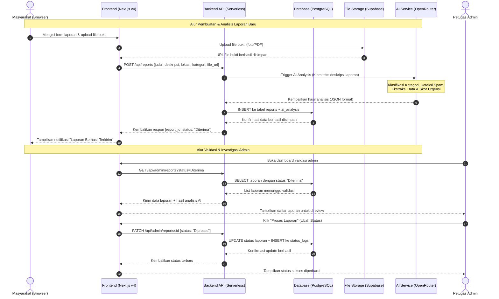
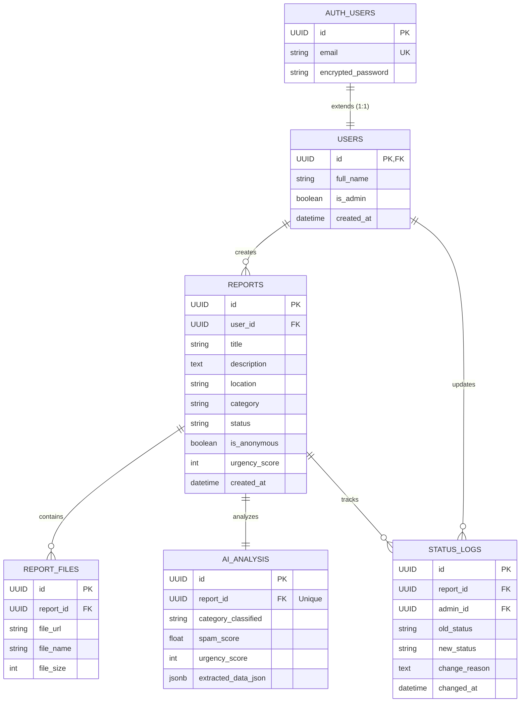

This is a [Next.js](https://nextjs.org) project bootstrapped with [`create-next-app`](https://nextjs.org/docs/app/api-reference/cli/create-next-app).

## Getting Started

First, run the development server:

```bash
npm run dev
# or
yarn dev
# or
pnpm dev
# or
bun dev
```

Open [http://localhost:3000](http://localhost:3000) with your browser to see the result.

You can start editing the page by modifying `app/page.tsx`. The page auto-updates as you edit the file.

This project uses [`next/font`](https://nextjs.org/docs/app/building-your-application/optimizing/fonts) to automatically optimize and load [Geist](https://vercel.com/font), a new font family for Vercel.

## Learn More

To learn more about Next.js, take a look at the following resources:

- [Next.js Documentation](https://nextjs.org/docs) - learn about Next.js features and API.
- [Learn Next.js](https://nextjs.org/learn) - an interactive Next.js tutorial.

You can check out [the Next.js GitHub repository](https://github.com/vercel/next.js) - your feedback and contributions are welcome!

## Deploy on Vercel

The easiest way to deploy your Next.js app is to use the [Vercel Platform](https://vercel.com/new?utm_medium=default-template&filter=next.js&utm_source=create-next-app&utm_campaign=create-next-app-readme) from the creators of Next.js.

Check out our [Next.js deployment documentation](https://nextjs.org/docs/app/building-your-application/deploying) for more details.

# LaporAman (Lapor In) 
### Platform Pelaporan Pungutan Liar Berbasis Web dengan Integrasi AI
> **Melawan Pungli, Jelas dan Aman** | *Project MVP – SDG 16: Peace, Justice, and Strong Institutions*

---

## Overview

**LaporAman** adalah platform modern berbasis web responsive yang mendayagunakan masyarakat untuk melaporkan praktik korupsi, suap, dan pungutan liar (pungli) di berbagai sektor pelayanan publik secara mudah, aman, dan transparan. 

Proyek ini dibangun menggunakan arsitektur **Next.js 14 App Router** dengan kendali penuh di sisi Frontend. Sistem ini dilengkapi dengan integrasi **Artificial Intelligence (AI)** melalui OpenRouter (Claude 3 / Llama 2) untuk melakukan analisis otomatis, klasifikasi kategori kasus, deteksi draf laporan spam, hingga kalkulasi skala prioritas secara real-time demi efisiensi penanganan oleh pihak admin.

---

## Requirements

### Fungsional (Functional Requirements)
* **Manajemen Autentikasi:** Sistem registrasi akun baru, masuk akun (*login*), fungsi lupa kata sandi, dan pembaruan data profil pengguna.
* **Wizard Pelaporan Fleksibel:** Pengisian form multi-step yang mencakup rincian judul, deskripsi kronologi, lokasi wilayah, kategori pungli, tanggal kejadian, serta opsi anonimitas pelapor.
* **Media Pembuktian:** Fasilitas unggah berkas pendukung (foto/dokumen bukti transaksi) dengan batas kapasitas maksimal 5MB per unggahan.
* **Dasbor Manajemen Admin:** Panel khusus manajemen admin untuk meninjau laporan masuk, memfilter kasus, mengubah status pelacakan, dan menyematkan catatan internal tim.


---

## Core Features

* **Anonimitas Ganda (Anonymous Mode):** Opsi penyamaran identitas pelapor (mengosongkan relasi data pengguna pada database) demi memberikan jaminan keamanan absolut dari risiko intimidasi atau perlakuan tidak adil.
* **AI Inteligensia (Analisis Laporan Otomatis):** Integrasi OpenRouter untuk mengekstrak entitas penting secara otomatis, mengkategorikan jenis kasus, menyaring laporan spam, dan menghitung skor urgensi kasus (skala 1-10).
* **Pelacakan Status Real-time (Tracking Timeline):** Visualisasi kronologi perkembangan laporan yang transparan bagi pelapor, mulai dari status `Diterima` ──> `Ditinjau` ──> `Diproses` ──> hingga `Selesai` / `Ditolak`.
* **Pencarian & Penyaringan Lanjutan (Advanced Filter):** Fasilitas bagi admin untuk mengisolasi tumpukan laporan berdasarkan wilayah lokasi, rentang waktu, status pelacakan, dan tingkat keparahan skor AI.

---

## User Flow

### Alur Pelapor (User Journey)
* **Onboarding:** Pengguna membuat akun baru, mengisi kredensial, dan dialihkan ke halaman dasbor utama.
* **Pengisian Data:** Pengguna mengklik "Buat Laporan Baru", mengisi form rincian kronologi, memilih opsi anonimitas, melampirkan berkas bukti fisik, lalu mengirimkan laporan.
* **Verifikasi Status:** Pengguna secara berkala mengunjungi tab "Riwayat Laporan" untuk memeriksa status pembaruan atau catatan resmi dari tim penindak.

---

##  System Architecture

Berikut adalah gambaran arsitektur sistem dan aliran data pelaporan pada platform LaporAman:



---

## Database Schema

Berikut adalah Entity Relationship Diagram (ERD), memisahkan modul Autentikasi bawaan (`auth.users`) dengan tabel data dinamis platform LaporAman:


| Skema | Tabel | Deskripsi |
| :--- | :--- | :--- |
| `auth` | **AUTH_USERS** | Tabel internal bawaan Supabase Auth yang menangani enkripsi kredensial, email, dan verifikasi token secara otomatis aman. |
| `public` | **USERS** | Profil publik pengguna yang memperluas (*extends*) data dari `auth.users` via UUID untuk menyimpan nama lengkap dan penanda hak akses admin. |
| `public` | **REPORTS** | Entitas utama laporan pungli yang dikirim masyarakat, mendukung penyimpanan relasi data kosong (*nullable*) saat Mode Anonim diaktifkan. |
| `public` | **REPORT_FILES** | Menyimpan alamat URL publik dari *bucket* **Supabase Storage** tempat berkas foto atau dokumen bukti fisik diunggah. |
| `public` | **AI_ANALYSIS** | Memanfaatkan tipe data **JSONB** khas PostgreSQL untuk menyimpan log ekstraksi teks, skor spam, dan tingkat urgensi dari OpenRouter AI. |
| `public` | **STATUS_LOGS** | Rekaman jejak audit (*audit trail*) otomatis setiap kali admin mengubah status investigasi laporan demi menjaga transparansi alur. |

## Design & Technical Constraints
Batasan Antarmuka & Seni Desain (UI/UX)
1. Filosofi Gaya: Menggunakan konsep Modern Minimalist yang bersih, berfokus penuh pada kegunaan (usability) dan kecepatan aksesibilitas halaman.
2. Tipografi: Wajib menggunakan rumpun font sans-serif ("Plus Jakarta Sans" untuk tajuk judul utama dan "Inter" untuk teks paragraf tubuh halaman).

Batasan Teknis & Batasan Sumber Daya (Technical Scope)
1. Kapasitas Unggahan Berkas: Batas maksimal ukuran berkas adalah 5MB per file dengan format yang diizinkan hanya terbatas pada JPG, PNG, dan PDF.
2. Keterbatasan AI: Operasional analisis AI memanfaatkan skema Free Tier Pay-as-you-go dari OpenRouter tanpa proses Custom Machine Learning Training. Akurasi analisis sangat bergantung pada rincian kualitas teks kronologi pelapor.
3. Penyimpanan Database: Kuota penyimpanan penyimpanan gratis basis data Supabase dibatasi maksimal hingga 1 Gigabyte (GB) selama masa fase pembuktian konsep MVP.

## Assumptions & Notes (Asumsi & Catatan)
Asumsi Sistem
1. Pengguna memiliki koneksi jaringan internet yang stabil dan mengoperasikan peramban web modern terkini (Chrome, Firefox, Safari, atau Edge).
2. Pelapor bersedia mengisi draf data awal di dalam formulir dan secara sadar melampirkan berkas bukti fisik otentik agar laporan dapat diproses ke tingkat lanjut oleh admin.

Catatan Penting 

Ruang lingkup aplikasi fase MVP ini tidak mencakup aplikasi mobile native (iOS/Android), tidak terhubung langsung ke server resmi pengaduan instansi pemerintah nasional (seperti SP4N-LAPOR!), dan tidak memiliki fitur interaksi obrolan langsung (live chat) antara pelapor dan petugas admin. Fitur tersebut didelegasikan sepenuhnya pada rencana pengembangan fase rilis lanjutan di masa mendatang.
